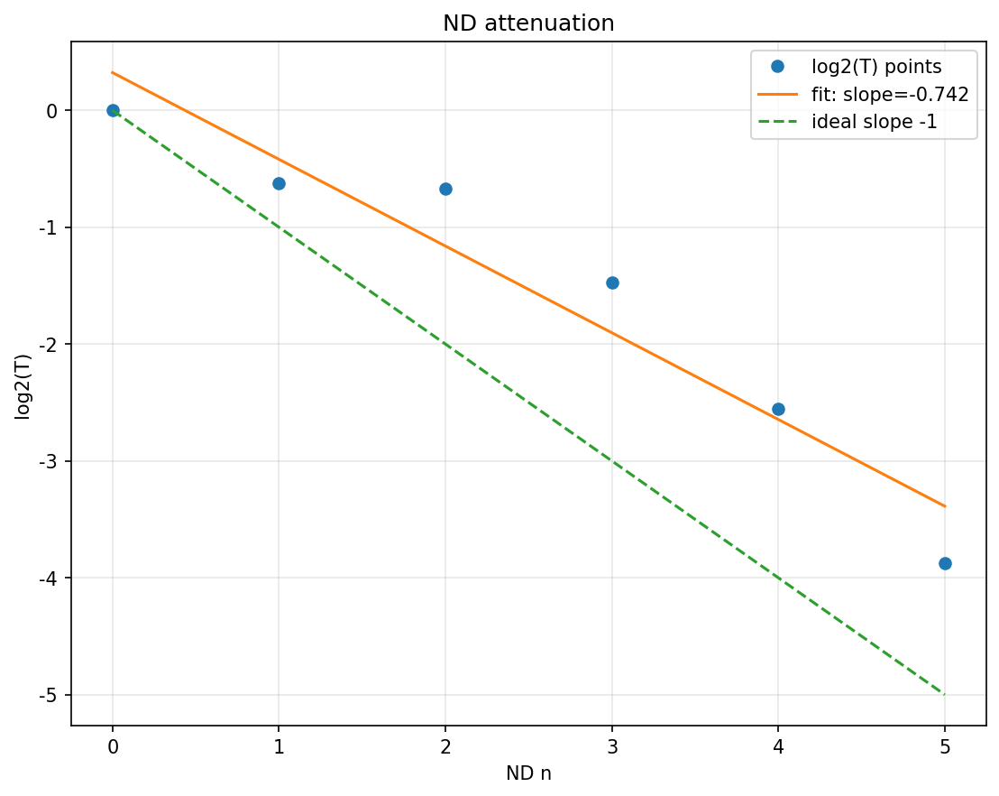
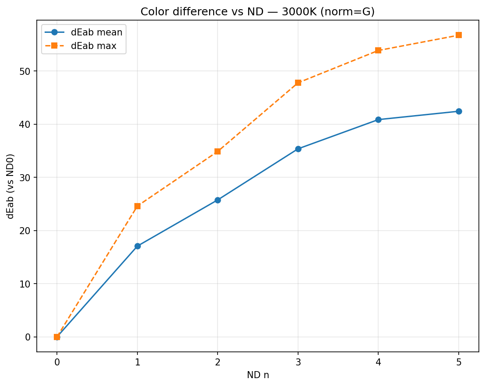
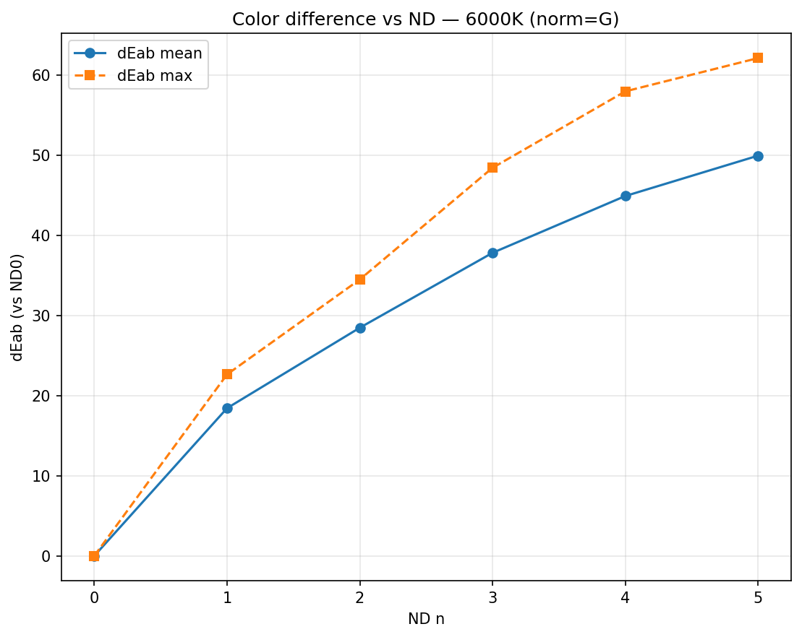

# ND Filter Experiment — Final Package


## Summary
This repo studies **variable ND filters** in the RAW domain.  
We (i) measure transmission vs. nominal stops,  
(ii) quantify color neutrality (ΔE*ab and channel ratios) under **3000K / 6000K**,  
and (iii) provide a fully reproducible pipeline.

**Key findings**
- Transmission closely follows **T ≈ 2⁻ⁿ** with small deviations at higher densities.
- Color neutrality drifts with density; **warm vs. cool** illuminants bias differently.
- All figures and CSVs are reproducible via scripts in `code/`.

## Results (quick view)
<p float="left">
  
  
  
</p>

---

## Package layout
- `code/` — Python scripts
- `data/` — CSV outputs
- `figs/` — Figures
- `roi/` — ROI overlays

---

## Requirements
- Python 3
- Install with:
```bash
python -m venv .venv && source .venv/bin/activate
pip install -r requirements.txt

[200~EOF
